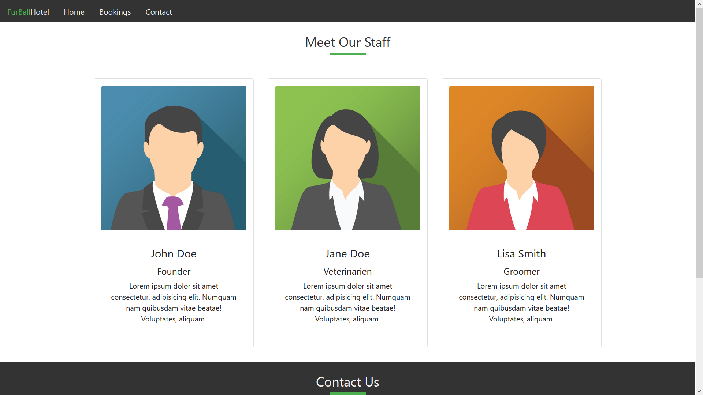
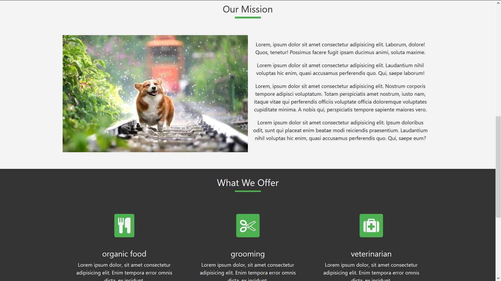
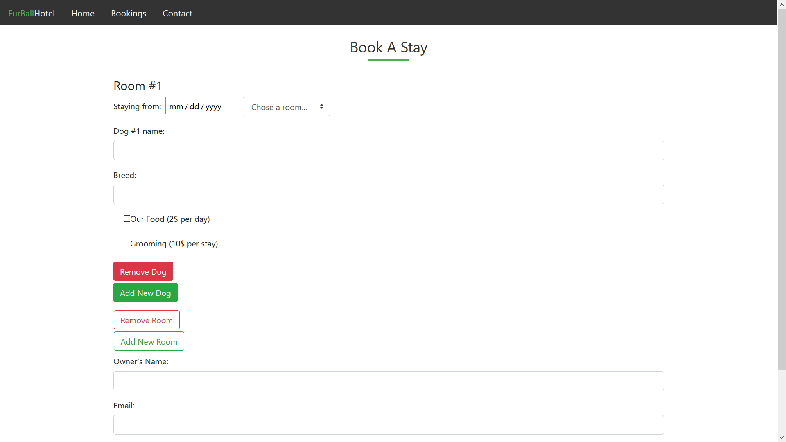

# first-NEW

A second take on my first React practice project, now with functioning implementation of React Router and with basic Node.js/Express server setup. This is a small responsive website for pets hotel with three pages. 

# Screenshots:
 
 

## Technologies: 
ReactJS, Typescript, Bootstrap, Node.js, Express.js

If you want to take a look, just clone the project or download a .zip file, and run the following command in the terminal: npm run dev.

## Important note: 
covalence boilerplate (https://github.com/covalence-io/barebones-react-typescript-express) was used for this project!

